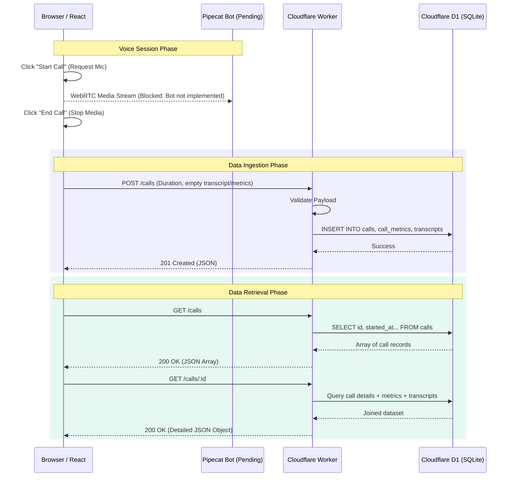

# Mini Call Log Service

## 1. Project Overview
The Mini Call Log Service is a web application designed to log, store, and display metadata from AI-powered voice conversations. It features a premium, responsive React dashboard that seamlessly tracks call history, transcripts, and model latencies using a Cloudflare Worker API backed by a D1 database.

## 2. Implemented Features
- **Call Dashboard:** A sleek, dark-themed responsive UI (built with React/Vite) that lists past calls.
- **Detailed Call View:** Select a call to view its metadata (start/end times, duration), latency metrics (STT, LLM, TTS), and a full chat transcript.
- **Live Call Simulation:** A frontend UI shell for initiating and ending a voice call, which requests microphone access and submits a final call log to the backend upon ending.
- **Serverless API:** A fast, secure Cloudflare Worker providing robust validation and RESTful endpoints for call data ingestion and retrieval.
- **CORS Handling:** Custom preflight `OPTIONS` and middleware wrapping to seamlessly connect the Vite dev server to the Worker.
- **Database Resilience:** Duplicate submission protection (409 Conflict) and payload validation for latency metrics.

## 3. Architecture and Request Flow


*(Note: The WebRTC stream to Pipecat is currently a placeholder; the frontend directly submits the API request upon ending the call).*

## 4. Technology Stack
- **Frontend:** React, Vite, Vanilla CSS (Premium Glassmorphism Dark Mode), Google Fonts (Outfit, Inter)
- **Backend:** Cloudflare Workers (Serverless)
- **Database:** Cloudflare D1 (Serverless SQLite)
- **Voice Agent (Pending):** Pipecat (Python)

## 5. Repository Structure
```text
.
├── bot/                       # Python Pipecat Voice Agent (Currently Empty)
│   ├── bot.py                 # (Pending) Main bot logic
│   └── requirements.txt       # (Pending) Python dependencies
├── frontend/                  # React + Vite UI
│   ├── .env.example           # Example environment variables
│   ├── package.json           # Frontend dependencies
│   └── src/                   # Source code (App.jsx, App.css)
└── worker/                    # Cloudflare Worker API
    ├── migrations/            # D1 SQL schemas (001_initial.sql)
    ├── src/                   # Worker source code (index.js)
    ├── test_api.js            # Node.js E2E testing script
    └── wrangler.jsonc         # Wrangler deployment config
```

## 6. Prerequisites
- **Node.js:** v18+ (for Vite and Cloudflare Wrangler)
- **npm:** v9+
- **Python:** 3.10+ (for the future Pipecat bot implementation)

## 7. Environment Variable Setup
Do not commit `.env` files containing live secrets!

**Frontend:**
Copy `.env.example` to `.env` in the `frontend` directory:
```bash
cd frontend
cp .env.example .env
```
Ensure the API URL points to the local worker:
```text
VITE_API_URL=http://localhost:8787
```

## 8. How to Create/Configure D1 and Apply Migrations Locally
To initialize the local SQLite database used by D1:
```bash
cd worker
npx wrangler d1 migrations apply DB --local
```

## 9. How to Run the Worker Locally
Start the Cloudflare Worker on port `8787`:
```bash
cd worker
npx wrangler dev
```

## 10. How to Run the Frontend Locally
In a separate terminal, start the Vite development server:
```bash
cd frontend
npm install
npm run dev
```

## 11. How to Run the Pipecat Bot Locally
*Currently Blocked: The `bot/bot.py` file is empty.* 
Once implemented, you would typically run:
```bash
cd bot
pip install -r requirements.txt
python bot.py
```

## 12. Required Third-Party API Credentials
Currently, no third-party API keys are required for the web dashboard or Worker.
*Future:* When the Pipecat bot is implemented, it will require keys for LLM (e.g., OpenAI/Anthropic), STT (e.g., Deepgram), and TTS (e.g., Cartesia), which should be configured in `bot/.env`. Ensure you never expose these provider keys in the React frontend code.

## 13. Existing API Endpoints
### `GET /health`
Returns system status.
**Response:** `200 OK`
```json
{ "ok": 1 }
```

### `POST /calls`
Saves a new call record.
**Payload:**
```json
{
  "id": "call_123",
  "startedAt": "2026-10-01T10:00:00Z",
  "endedAt": "2026-10-01T10:02:00Z",
  "duration": 120,
  "transcript": [
    { "speaker": "user", "text": "Hello" }
  ],
  "metrics": { "stt": 120, "llm": 600, "tts": 300 }
}
```
**Response:** `201 Created`
*(Note: Empty transcript `[]` and missing `metrics` are handled gracefully).*

### `GET /calls`
Retrieves a summary of all past calls.
**Response:** `200 OK`
```json
[
  { "id": "call_123", "started_at": "2026-10-01T10:00:00Z", "ended_at": "2026-10-01T10:02:00Z", "duration": 120 }
]
```

### `GET /calls/:id`
Retrieves full details for a specific call ID, including joined metrics and transcript lines.
**Response:** `200 OK`
```json
{
  "id": "call_123",
  "started_at": "2026-10-01T10:00:00Z",
  "ended_at": "2026-10-01T10:02:00Z",
  "duration": 120,
  "transcript": [{ "speaker": "user", "text": "Hello" }],
  "metrics": { "stt": 120, "llm": 600, "tts": 300 }
}
```

## 14. How Call Transcripts and Latency Metrics are Collected
Currently, because the Pipecat bot is missing, the React frontend mocks the data ingestion by submitting an empty array for transcripts and an empty object for metrics upon ending a "Live Call". The Worker API safely processes this empty data and inserts `null` into `call_metrics`. 

When the Pipecat bot is built, it should be responsible for aggregating the final transcript array and exact latency metrics from its pipeline processors, and the bot itself should hit `POST /calls` before shutting down the WebRTC transport.

## 15. Testing Instructions
An End-to-End API test script is provided in the `worker` directory. It verifies data validation, duplicate checking (409 Conflict), and data retrieval.
To run the automated tests against a running worker:
```bash
cd worker
node test_api.js
```

## 16. Technical Decisions and Trade-offs
- **Custom CORS Wrapper:** Rather than using a heavy library, a lightweight `jsonResponse` wrapper was built directly into the Worker to inject `Access-Control-Allow-Origin: *` headers, ensuring minimal overhead.
- **Frontend State Handling:** React state is used to carefully lock button interactions (e.g., disabling 'Start Call' if already connected) to prevent race conditions and duplicate API submissions.
- **API Duplicate Protection:** The Worker performs an explicit `SELECT id` check before insertion to gracefully return a `409 Conflict` instead of crashing the database with a SQLite primary key constraint violation.

## 17. Known Limitations and Future Improvements
- **Missing Voice Transport:** Real voice communication over WebRTC is completely missing because the Pipecat python bot is unimplemented.
- **Missing Pagination:** The `GET /calls` endpoint returns all records. For production, `LIMIT` and `OFFSET` pagination should be implemented to support high volumes.

## 18. Demo Walkthrough

### Pre-Demo Setup
1. Open Terminal 1: `cd worker && npx wrangler dev`
2. Open Terminal 2: `cd frontend && npm run dev`
3. Open `http://localhost:5173` in a browser.

### The Walkthrough
1. **Showcase the Dashboard:** Point out the premium glassmorphism dark mode, highlighting the seamless integration between the layout and the typography.
2. **Start a Live Call:** Click **Start Call**. The browser will request microphone permissions. Accept them to simulate an active call session. Note that the status smoothly transitions to a glowing green "CONNECTED".
3. **End the Call:** Click **End Call**. The frontend cleans up the microphone tracks, calculates the duration, and submits a POST request to the Worker.
4. **View the Log:** Observe that the new call immediately appears in the Call History sidebar.
5. **Inspect Details:** Click the newly created call. Explain that because the bot is pending, the transcript explicitly states "No transcript available", but the timestamps and duration are accurately recorded.
6. **Backend Verification:** Open Terminal 1 and show the Worker logs acknowledging the successful POST and GET requests.
